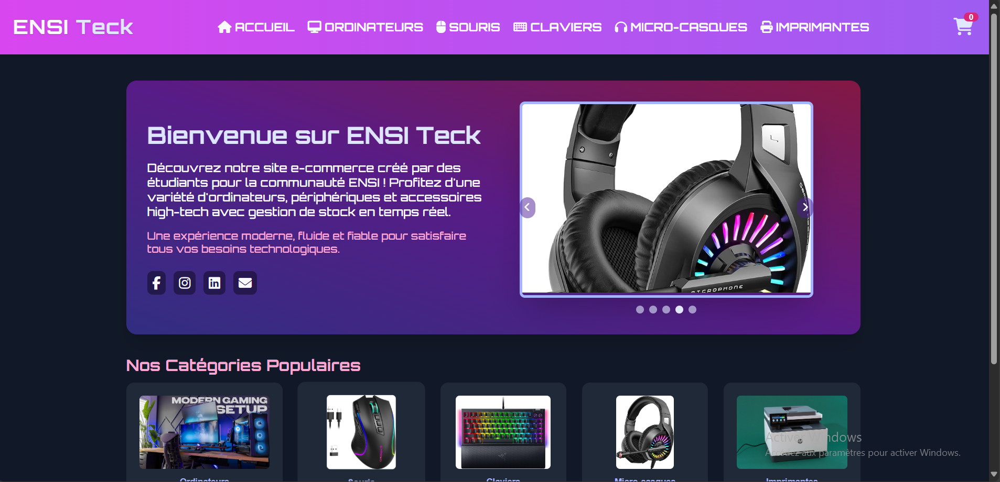

# ENSI_Teck

## Getting Started
This project is a simple e-commerce website for selling tech accessories such as keyboards, mice, laptops, and printers. It is built using HTML, CSS, and JavaScript, with no backend integration.
## About This Project
- Browse items by category (keyboards, mice, laptops, printers)

- Add items to a shopping cart

- Fill in a delivery form (name, address, etc.)

- View and update your cart

- Simulate order placement
This project is fully responsive and provides a clean user interface designed for a smooth shopping experience.
# Setting the project
**To run the project:**
1. Clone the repository

2. Open index.html in your browser

3. Start exploring the site

# Technologies Used
- HTML5

- CSS3

- JavaScript (Vanilla JS)

[linkedin-shield]: https://img.shields.io/badge/-LinkedIn-black.svg?style=for-the-badge&logo=linkedin&colorB=555

